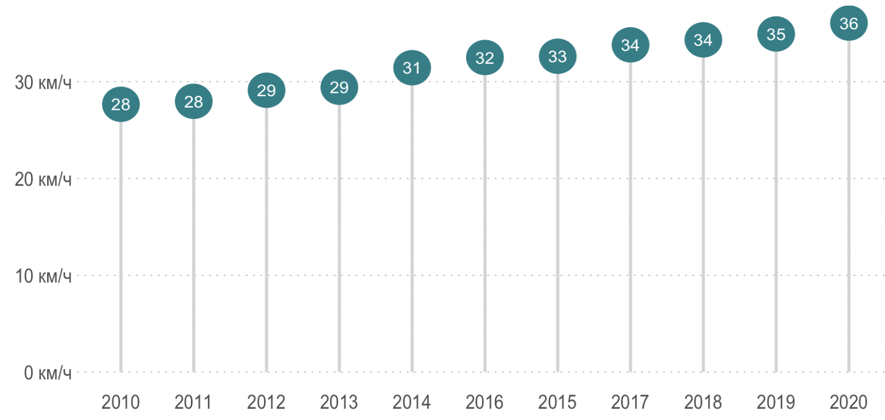

# Аннотация {.unnumbered}

Здесь будет аннотация статьи. 

<details>
<summary>Пример скрытого текста</summary>

Lorem pharetra erat bibendum pharetra, tellus metus mi mi molestie; risus natoque justo. Curabitur aliquet venenatis risus, urna, libero lobortis erat nibh? Per lectus sem dictumst nullam aliquet risus velit lacus cras tempus. Faucibus rhoncus faucibus tempus varius.

</details>

# Введение {.unnumbered}



Пример сноски,[^1] и другой.[^longnote]

[^1]: Это сноска.

[^longnote]: Вот сноска с несколькими блоками.

    Последующие абзацы выделены отступом, чтобы показать, что они относятся к предыдущей сноске.

        { some.code }

    Можно использовать весь абзац целиком.

Этот абзац не будет частью примечания, поскольку он не предназначен для этого.

# Методология исследования



## Исходные данные



## Методы анализа

Анализ исходных данных проводился с использованием с помощью языка программирования **R** [@r-s; @stat-graphics; @Geocomputation_with_R], книга по моделированию: @Feat_Eng_Kuhn.

# Результаты



```{r}
#| label: fig-penguins-margins
#| fig-cap: "Пример графика на полях"
#| column: margin
#| message: false
#| warning: false

library(tidyverse)
library(palmerpenguins)

penguins |> 
  na.omit() |> 
  ggplot(aes(x = bill_length_mm,
             y = bill_depth_mm,
             fill = species,
             size = body_mass_g)) + 
  geom_point(pch = 21,
             color = "white", 
             alpha = 0.7) +
  labs(x = "", y = "") +
  scale_fill_manual(
    values = c(Adelie = "#0072B2", 
               Chinstrap = "#D55E00", 
               Gentoo = "#018571")) +
  theme(legend.position = "none")
```

## Первый результат

:::: {.panel-tabset}

## Диаграмма рассеяния
```{r}
#| warning: false
#| message: false
library(ggplot2)

mpg |>
  ggplot(aes(x = displ, y = hwy, 
             colour = class)) + 
  geom_point()
```

## Диаграмма размаха

```{r}
#| warning: false
#| message: false
library(ggplot2)
library(dplyr)

mpg |>
  mutate(class = reorder(class, displ)) |>
  ggplot(aes(x = class, y = displ, 
             fill = class)) +
  geom_boxplot()
```

## Данные

```{r}
#| warning: false
#| message: false

library(dplyr)

mpg |>
  head() |>
  select(manufacturer, model, year,
         displ, hwy, class) |>
  knitr::kable()
```

::::

## Второй результат

Найдем суммарные показатели по различным категориям. Как видно из таблицы ниже, более половины значений приходится на сельские населенные пункты.

|     | тип населенного пункта            | показатель | процент |
|-----|:----------------------------------|-----------:|---------|
| 1   | Сельский населенный пункт         | 17 756 913 | 53,35%  |
| 2   | Город                             | 11 240 888 | 33,77%  |
| 3   | Вне территории населенного пункта | 2 835 312  | 8,52%   |
| 4   | Населенный пункт городского типа  | 1 346 053  | 4,04%   |
| 5   | Станция                           | 68 661     | 0,21%   |
| 6   | Вахтовый поселок                  | 15 773     | 0,05%   |
| 7   | Жилой поселок при станции         | 11 391     | 0,03%   |
| 8   | Разъезд, перегон                  | 10 580     | 0,03%   |
| 9   | не указан                         | 853        | 0,00%   |

: Суммарные показатели по типам населенных пунктов {#tbl-total_distances}

См. таблицу: @tbl-total_distances.

{fig-align="left" #fig-values}

См. иллюстрацию: [рис. @fig-values].

Линейная регрессионная модель выражается соотношением
$$
y = \beta_1 x_1 + \beta_2 x_2 + \ldots + \beta_n x_n + \varepsilon.
$$ {#eq-regression}

См. уравнение: @eq-regression.

```{dot}
//| label: fig-graphviz-example
//| fig-width: 5
//| fig-cap: |
//|   Пример Graphviz-диаграммы
digraph {
    Москва -> Минск[color=red,label="0.2",weight="0.2"];
    Москва -> Казань[label="0.4",weight="0.4"];
    Казань -> Минск[color=red,label="0.6",weight="0.6"];
    Казань -> Воронеж[label="0.6",weight="0.6"];
    Воронеж -> Воронеж[label="0.1",weight="0.1"];
    Воронеж -> Минск[color=red,label="0.7",weight="0.7"];
}
```

# Обсуждение

Из полученных результатов можно сделать следующие выводы:

1. Средние показатели за 2024-2025 года снизились...
2. Регионами с наибольшими показателями являются...

Можно предположить, что...

:::{.callout-tip}
## Совет

Всегда используйте Quarto.
:::

# Заключение {.unnumbered}

В работе были кратко рассмотрены статистические данные по некоторым основным параметрам. Был использован Quarto версии .

::: {.callout-note collapse="true" icon="false"}
## Информация о библиотеках R

```{r}
#| message: false
#| echo: false
sessioninfo::session_info()
```
:::

# Список литературы {.unnumbered}